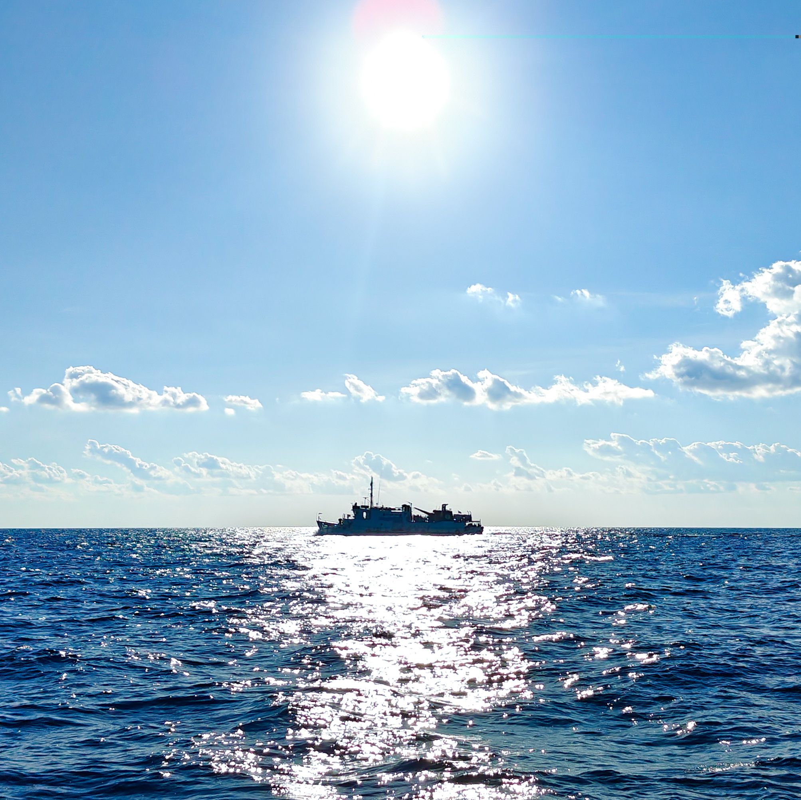

Something is listening now.

This is a working log for a robotics and control-systems engineer's projects, archive, and the occasional stray thought. Expect case files on the robots I build — pendulums, arms, an underwater vehicle that took three tries to stop leaking, a fish that swims better in simulation than most fish swim in the ocean. Expect an archive of photographs alongside them, not because they're related, but because a person is more than their case files.

The site is built to be read two ways at once: plainly, if you're here for the work, and cryptically, if you want to poke at the corners. Both are real. Nothing behind the redaction bars is load-bearing — the actual information is always in the open, one hover or tap away.

More will surface as it's built. For now: the signal is live, the archive is open, and the terminal is one keystroke away, if you know which key.

 

*First light, somewhere with a horizon.*
